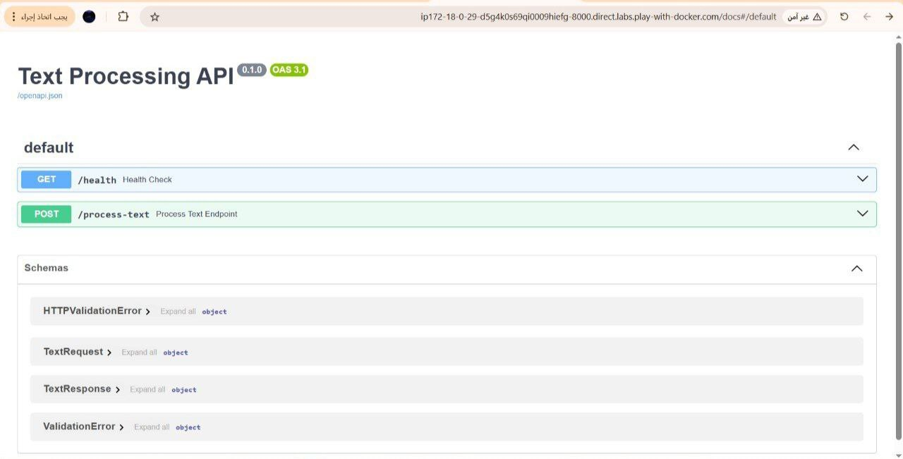
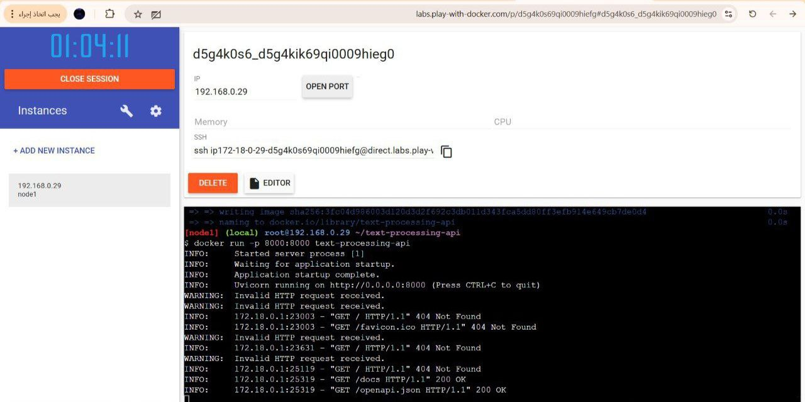

# Text Processing API

This project is a simple RESTful API developed using **FastAPI**.
The goal of the project is to apply the concepts of API development,
clean code, validation, HTTP status codes, Docker, and GitHub version control.

# Project Idea

The API receives a text input and performs simple processing operations such as:
- Cleaning the text
- Removing extra spaces and special characters
- Converting text to lowercase
- Counting the number of words

This project was built to demonstrate how an API can be structured in a clean
and maintainable way.

# Project Structure

The project follows a clean code structure where each file has a single responsibility:

text-processing-api/
│
├── app/
│ ├── main.py # Application entry point
│ ├── routes.py # API endpoints
│ ├── services.py # Text processing logic
│ ├── schemas.py # Request & response validation
│
├── Dockerfile
├── requirements.txt
├── README.md

# API Endpoints

## 1-Health Check Endpoint

-GET health

This endpoint was added to quickly check if the API is running correctly.

Response:
{
  "status": "ok"
}
Status Code:

200 OK

## 2- Text Processing Endpoint
-POST  process-text

Request Body:

{
  "text": "   Hello WORLD!!!   "
}
Response:

{
  "cleaned_text": "hello world",
  "word_count": 2
}

Status Codes:

200 OK → Request processed successfully

400 Bad Request → Empty text was sent

422 Unprocessable Entity → Invalid request format

## Text Processing Logic
The text processing logic is implemented in the services.py file.
Separating this logic from the API routes helped keep the code clean
and easier to understand and maintain.

# Running the Project Locally
Install dependencies:

pip install -r requirements.txt
Run the API:

uvicorn app.main:app --reload
Access Swagger UI:

http://127.0.0.1:8000/docs

## Running the Project with Docker
The application was containerized using Docker.

Because Docker could not be installed directly on my local machine,
I used Play with Docker, which is an official online environment
provided by Docker.

Steps:

docker build -t text-processing-api .
docker run -p 8000:8000 text-processing-api
The API was successfully accessed through Swagger UI inside the Docker container.

## Challenges and Issues Faced
During the development of this project, I faced several challenges:

1️⃣ Docker Installation Issues
Docker could not be installed on my local machine due to system limitations.
This issue was resolved by using Play with Docker, which allowed me to
build and run the container successfully.

2️⃣ Understanding HTTP Status Codes
At first, it was unclear when to use different status codes.
This was solved by:

Using 200 OK for successful requests

Using 400 Bad Request when the input text was empty

Relying on FastAPI validation to return 422 for invalid requests

3️⃣ GitHub Branch Management
Initially, some commits were made before creating separate branches.
This was later fixed by organizing the project into feature-based branches
and maintaining clear commit messages for each change.

## Testing
The API was tested using:
Swagger UI
Docker container environment
All endpoints returned the expected responses.

## Screenshots

### Swagger UI
This screenshot shows the Swagger UI documentation for the API endpoints.

### Docker Running
This screenshot shows the application running successfully inside a Docker container.

##  Technologies Used
Python
FastAPI
Pydantic
Uvicorn
Docker
Git & GitHub

